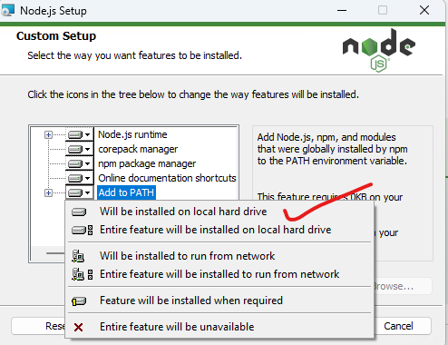
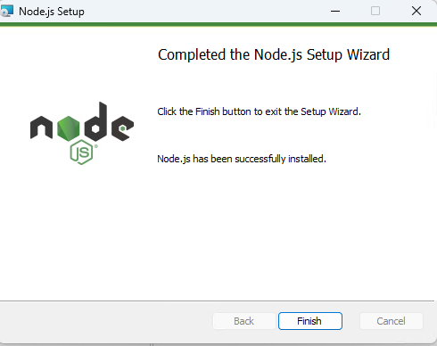
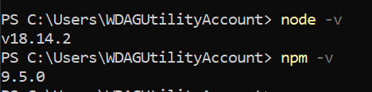
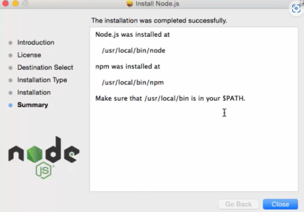
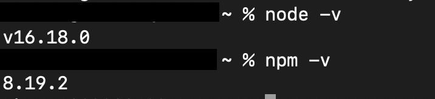

# Installing Node.js on different platforms

## Contents

Installing Node.js on different platforms:

- [Windows](#windows)
- [Mac](#mac)
- [Linux](#linux)

## Windows

1. Download the Windows installer from the [Node.js website](https://nodejs.org/en/download/).
2. Run the installer (the `.msi` file you downloaded in the previous step.)
3. Follow the prompts in the installer (Accept the license agreement, click the NEXT button a bunch of times and accept the default installation settings).
4. Make sure you check the Add to PATH option. It should be selected by default. If you don't select this option, you'll have to update your `PATH` environment variable manually to run `node` from the command line. 
5. You can install the optional tools, but they're not required for this course. 
6. Click the install button, and wait for the installation to complete. 
7. Open a new command prompt/powershell and verify that Node.js was installed correctly by running the following commands: `node -v` & `npm -v`.
    > You should see something like this, but with a different version number: 
8. You're done! You can now use `node` and `npm` from the command line.

## Mac

1. Download the Mac installer from the [Node.js website](https://nodejs.org/en/download/).
2. Run the installer (the `.pkg` file you downloaded in the previous step.)
3. Follow the prompts in the installer (Accept the license agreement, click the continue button a bunch of times and accept the default installation settings).
4. Wait for installation to complete. 
5. Open a new terminal and verify that Node.js was installed correctly by running the following commands: `node -v` & `npm -v`.
    > You should see something like this, but with a different version number: 
6. You're done! You can now use `node` and `npm` from the command line.

## Linux

1. Download the Linux installer from the [Node.js website](https://nodejs.org/en/download/).
2. Open a terminal and navigate to the directory where you downloaded the file.
3. Unpack the file using the tar command: `tar -xvf node-v16.18.0-linux-x64.tar.xz` (where `node-v16.18.0-linux-x64.tar.xz` is the name of the file you downloaded).
4. Copy the extracted folder to the `/usr/local` directory: `sudo cp -r node-v16.18.0-linux-x64 /usr/local/`.
5. Add the `bin` directory of the newly created folder to the `PATH` environment variable: `export PATH=/usr/local/node-v16.18.0-linux-x64/bin:$PATH`.
6. Open a new terminal and verify that Node.js was installed correctly by running the following commands: `node -v` & `npm -v`.
    > You should see something like this, but with a different version number: 
7. You're done! You can now use `node` and `npm` from the command line.
